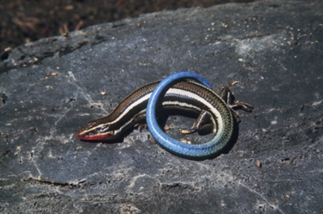

```{r setup, include=FALSE} 

#This bit of code turns off warning messages in your R markdown output.
knitr::opts_chunk$set(warning = FALSE, message = FALSE) 
```




```{r include=FALSE}
#Add your metadata here!

Project_area<-"Western Skink range in British Columbia"
Area_size<-"58,384 km2"
Current_scientific_name<- "Plestiodon skiltonianus"
Previous_scientific_names<- "Eumeces skiltonianus"
Common_names<-"Western Skink"
Species_code<-"R-PLSK"
Provicial_ranking<-"Blue"
Federal_ranking<-"Special Concern (COSEWIC), Special Concern (SARA)"
Cultural_significance<-"N"
Life_requisite<-"NA"
Life_stage<-"LIA"
SHM_objective<-"Guiding field surveys"
Funding_source<-"BC Conservation Data Centre"
Model_creation_date<-"XX-XX-XXXX"
Model_evaluators<-"John Doe, R.P.Bio."
Model_evaluation_date<-"XX-XX-XXXX"
Disclaimer<- "This model should not be used for X, X,X,X"
Suggested_citation<-"SHM Working Group. 2023. Western Skink (Plestiodon skiltonianus) habitat model for BC Range. Created on 15 March 2023."

```


```{r include=FALSE}
SHMPlanning_mat<- matrix(data = c(Project_area, Area_size,  Current_scientific_name,Previous_scientific_names, Common_names, Species_code, Provicial_ranking, Federal_ranking,Cultural_significance, Life_requisite, Life_stage, SHM_objective, Funding_source, Model_creation_date, Model_evaluators, Model_evaluation_date, Disclaimer, Suggested_citation), nrow = 1, ncol = 18)

colnames(SHMPlanning_mat)<-c("Project_area", "Area_size",  "Current_scientific_name","Previous_scientific_names", "Common_names", "Species_code", "Provicial_ranking", "Federal_ranking","Cultural_significance", "Life_requisite", "Life_stage", "SHM_objective", "Funding_source", "Model_creation_date", "Model_evaluators", "Model_evaluation_date", "Disclaimer", "Suggested_citation")

SHMPlanning_tab<-as.data.frame(SHMPlanning_mat)

transpose<-t(SHMPlanning_tab)
```


```{r echo=FALSE}

library(knitr)
kable(transpose)
```

